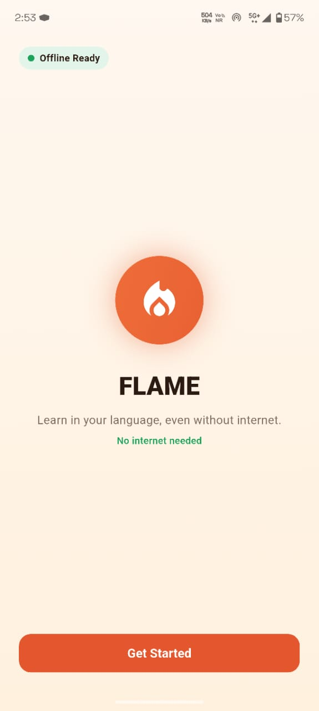
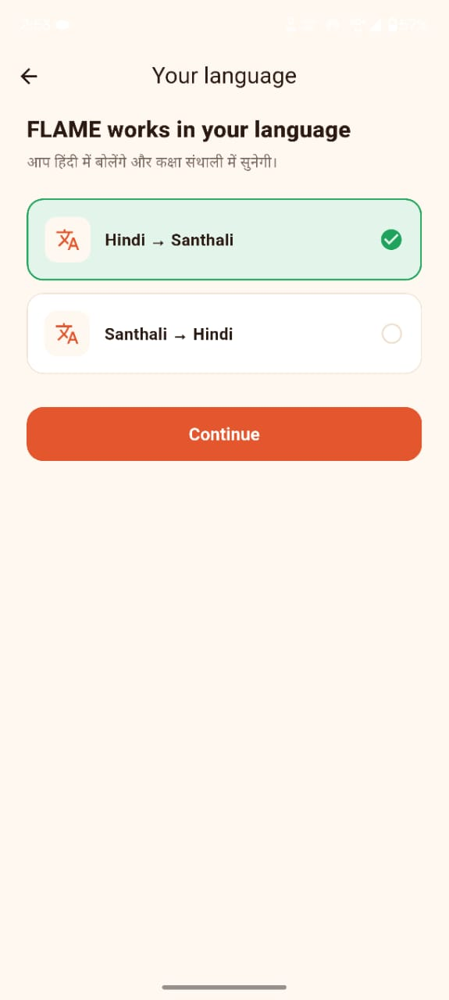
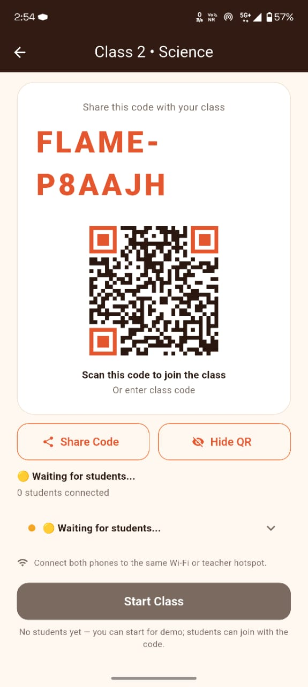
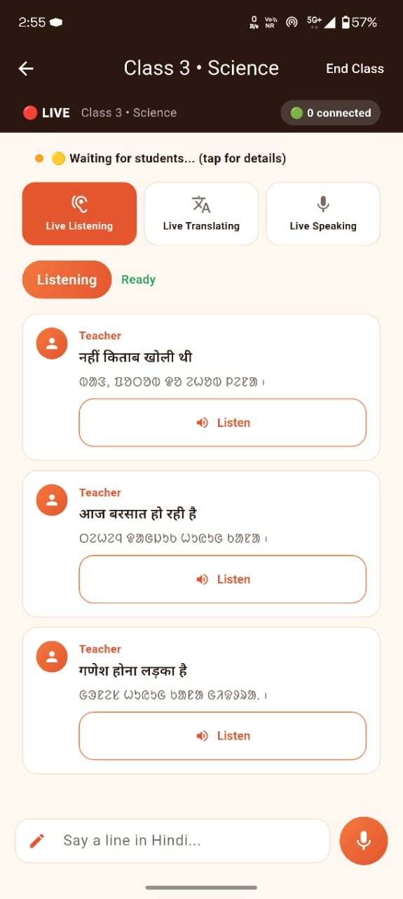

# FLAME - Future-ready Language Assistant for Mother-tongue based Education

<p align="center">
  
  
  
  
  
</p>
<p align="center">
  
  
  
  
  
  
</p>

> **Smart India Hackathon 2026 - Problem Statement 26042**
> **AI-Powered Vernacular Pedagogy and Real-Time Translation Tool for Mother Tongue-Based Primary Education**
> Theme: Smart Education - Category: Software - Team ID: 142623 - Team: ForestFlame
> Package `com.flame.flame` - Version `1.0.0+1` - Android 7.0+ (API 24) - Offline-first - 2GB+ RAM tablets

An offline-first Android app that helps teachers and students in primary classrooms translate between **Hindi** and **Santali (Ol Chiki)**, using on-device speech recognition and neural machine translation.

Teacher hosts a class on one phone, students join from their phones over the same Wi-Fi / hotspot - no internet, no cloud.

## Features

- **Hindi <-> Santali / Ol Chiki** offline translation (phrase cache + IndicTrans2 INT8 ONNX)
- **Speech-to-text** (offline Vosk Hindi `small-hi-0.22`)
- **Speech-out** (Hindi system TTS + Santhali Piper VITS voice, never substituted)
- **Live classroom**: teacher Create -> code + `FLAME:CODE` QR -> waiting -> live -> summary; student Join by code / scan -> waiting -> live
- **FLN classroom lexicon** - `assets/fln/corpus_pairs.json` + `fln_lexicon.json`
- **QR / barcode scanning** (`qr_flutter` + `mobile_scanner`)
- **No internet required** - ASR/NMT/TTS run on-device; LAN text-only sync
- **Ol Chiki rendering** - bundled `NotoSansOlChiki.ttf`

## Core problem (from SIH deck)

1. **Language mismatch** - teacher speaks Hindi, students speak Santali / Ho / Mundari.
2. **Teacher shortage** - ~80% mapped PALASH schools report moderate-severe learning challenges from the language gap.
3. **Mixed classroom** - one class, many mother tongues.

Pipeline: **Recognize (ASR) -> Translate (NMT) -> Speak (TTS)**. Teacher knows the curriculum but not the mother tongue - FLAME converts instruction into the learner's language. Teacher phone acts as broadcaster.

## Ground validation (existing evidence)

- 19 students tested at a Zilla Parishad govt. school in Marathi + English + teacher interviews - 19/19 performed better in their familiar language; consistent drop in non-mother-tongue assessment.
- Google Meet with a Santali professor - dialect + Ol Chiki/Devanagari script-fragmentation inputs.
- Full field data: see Drive folder linked below. Prototype already tested offline in real life (GitHub + demo video links below).

## Screenshots (real device)

| Welcome | Language | Teacher waiting (QR) | Teacher live |
|---------|----------|----------------------|--------------|
|  |  |  |  |

More slots + capture guide: [`docs/screenshots/README.md`](docs/screenshots/README.md).

## Download

> APK only - no build required. Sideload it (enable *Install unknown apps*).

| Version | Package | Min Android |
|--------:|---------|-------------|
| [v1.0.0 - FLAME-v1.0.0.apk][release] | `com.flame.flame` | Android 7.0 (API 24) |

[release]: https://github.com/ganeshgawali2007-arch/FLAME-Future_ready-Language-Assistant_for-Mother_tongue_based-Education/releases/latest

Demo video (multi-device + latency) and field data: see **Links** section below.

## Tech Stack

| Component | Used for |
|-----------|----------|
| Flutter / Dart 3.13 | UI + app logic (`lib/`, `provider`, 17 screens) |
| ONNX Runtime | On-device NMT (IndicTrans2 `indic-indic-dist-320M` INT8) |
| Vosk | Offline Hindi STT (`assets/models/vosk-model-small-hi-0.22.zip`, 44.5 MB) |
| Piper VITS / flutter_tts | Santhali neural voice + Hindi system voice |
| SQLite (`sqflite`) | Lessons, knowledge base, sessions (local only) |
| QR (`qr_flutter` / `mobile_scanner`) | `FLAME:<CODE>` class join |
| `connectivity_plus`, `record` | LAN status, mic capture |

Native bridges: `MainActivity.kt`, `VoskAsrSession.kt`, `OnnxNmtSession.kt`, `SatTtsSession.kt` in `android/app/src/main/kotlin/com/flame/flame/`.

Tech workflow (classroom): Voice Capture -> ASR (Hindi) -> Translation (Hindi->Tribal) -> TTS (Tribal) -> Audio Playback -> Personalised output -> Replay & Cache. Teacher: Create Session -> Show Code+QR -> Start; Student: Discover (UDP broadcast) -> Receive -> TCP Connect & Join - LAN only, no cloud.

## Key innovations - done vs planned

- [x] Per-student personalisation - each student device renders its preferred language output (implemented for Santhali).
- [x] Multilingual support - **Santali implemented in prototype**; Mundari + Ho planned (same pipeline, new packs).
- [x] Curriculum-aligned NLP - lesson scripts from validated curriculum assets (SQLite seed + phrasebook).
- [x] Offline voice-bot fallback - Ask FLAME runs pre-scripted curriculum Q&A offline.
- [ ] Worksheets / flashcards / story-book PDF - seed tables exist, no dedicated UI yet (see `docs/` reports pattern).

## Models - what ships vs side-load

| Pack | Status in this repo | Size | Install |
|------|---------------------|------|---------|
| Vosk Hindi `small-hi-0.22` | bundled `assets/models/vosk-model-small-hi-0.22.zip` | 42 MB zip / 78 MB unpacked | auto-extract on first use (0.29 s measured) |
| NMT tokenizer | bundled `assets/nmt/` (merges/vocab) | ~17 MB | ships with app |
| NMT INT8 ONNX (`encoder*.onnx*`, `decoder*.onnx*`) | **not in git** (312 MB, 2 files >100 MB GitHub limit) | ~312 MB | **GitHub Release** `nmt-model-pack.zip` -> `Android/data/com.flame.flame/files/nmt_model/` -> Settings -> Check |
| Santhali Piper (`sat_piper_model.onnx` + `.json`) | **not in git** | ~60 MB + JSON | **GitHub Release** `sat-tts-voice-pack.zip` -> `.../files/sat_tts_voice/` -> Settings -> Check |
| Hindi `hi-IN` voice | device system TTS | - | Android Settings -> TTS -> install hi-IN data |

Do not commit `*.onnx`, `*.onnx.data`, `*.apk` to git - attach to Releases (2 GB limit). See `docs/MODELS.md`. RAM rule: models lazy-load per screen and release after session, so 2GB+ tablets hold only the active pipeline.

## Latency benchmarks (18 Sept 2026)

Full tables + method: [`docs/BENCHMARKS.md`](docs/BENCHMARKS.md).

Device: `ASUS_I003DD` - Snapdragon 865, Android 12 API 31 - App `com.flame.flame v1.0.0` - USB/adb, production-path self-tests.

| Stage | Input -> Output | Latency |
|-------|-----------------|---------|
| ASR | 4.44 s Hindi speech -> `चारो किताब को लो` | 370 ms load + 870 ms recog |
| NMT | Hindi -> Ol Chiki Santhali | **134 ms** (7 sentences: 63.7-138.5 ms, avg 93 ms) |
| TTS | Ol Chiki -> 1.49 s Santhali WAV (peak 0.62) | 60 ms synthesis |
| **Full voice-to-voice** | 4.44 s in -> 1.49 s out | **~1.9 s wall-clock (< 3.0 s target)** |

Device checks: cold start avg ~3026 ms (6 runs); Vosk extract 0.29 s.

> **Honest caveats:** ~1.9 s is a complete real-model host benchmark, not same-device live-mic on the ASUS. The ASUS session lacked the INT8 NMT + Santhali packs (probe `<100 ms, complete=false`) and `hi-IN` voice (`engineError -4`), so sub-3 s still needs validation on the target phone with all packs installed. Missing packs are reported as missing, never fabricated.

## Offline classroom (2 phones, no internet)

Same Wi-Fi / hotspot only. Teacher hosts ephemeral TCP + UDP `:40404`; student broadcasts `FLAME1 DISCOVER <CODE>`, gets `FLAME1 OFFER <port> <token>`, joins via TCP JSON (`join`/`joinAck` with 6-char code + 12-char token). Live turns are newline-JSON text (`turn` with `cid`/`seq`), relayed teacher->students, each side re-translates + re-speaks locally. Full spec: [`docs/OFFLINE_CONNECTIVITY.md`](docs/OFFLINE_CONNECTIVITY.md).

## Getting Started

1. Install **Flutter** (stable, SDK `^3.13.3`).
2. Clone:
   ```bash
   git clone https://github.com/ganeshgawali2007-arch/FLAME-Future_ready-Language-Assistant_for-Mother_tongue_based-Education.git
   cd FLAME-Future_ready-Language-Assistant_for-Mother_tongue_based-Education
   ```
3. Run:
   ```bash
   flutter pub get
   flutter analyze
   flutter test
   flutter run
   ```
4. Release:
   ```bash
   flutter build apk --release --split-per-abi   # lean per-device
   flutter build apk --release                   # fat APK
   ```

## Feasibility, risks, scale

- **Build:** one tribal language first (Santali), Hindi->tribal, <=3 s target, offline, low-cost Android.
- **Validate:** native speaker -> language data -> AI translation (IndicTrans2) -> native validation -> approved curriculum.
- **Deploy via PALASH footprint:** 1000+ govt primary schools, 8 districts, Santhali now, Mundari/Ho next, FLN focus + teacher capacity building.
- **What can break scale:** limited parallel data -> native-speaker corpus; script/dialect variation -> multi-script validation; speech/TTS quality -> human-verified audio; rural trust -> teacher/community feedback.
- **Roadmap:** Pilot Grades 1-3 -> Validate with speakers+teachers -> Expand curriculum -> Language scale Santhali->Ho->Mundari -> Institutional scale.
- **Why viable:** Android = low deploy cost; one validated asset -> lesson + audio + worksheet + flashcards; classroom corrections feed future data.

## Impact

- Familiar-language learning, teacher reach (one Hindi teacher -> many mother tongues), offline inclusion (<=2GB tablets, no connectivity block), scalable language packs.
- Scenario: Hindi-fluent teacher posted to Class 2-3 in Jharkhand tribal belt, students know only Ho/Mundari/Santali - FLAME bridges in real time so no classroom is lost in translation.

## Research & Links

- Bhasha Matters / PALASH - UNESCO Education Report India 2025 (`unesdoc.unesco.org`)
- Adi-Vaani - Ministry of Tribal Affairs AI translator (`drishtiias.com`)
- PALASH - 1,041 schools, 8 districts, JEPC (`news.careers360.com`)
- BHASHINI - National Language Translation Mission, MeitY (`bankersadda.com`)
- IndicTrans2 & ByT5 for English-Santali - ACL Anthology 2025 (`aclanthology.org`)
- MunTTS Mundari TTS - arXiv 2024 (`arxiv.org/abs/2401.15579`)
- AdiBhashaa benchmark - arXiv 2025 (`arxiv.org/pdf/2512.04765`)
- Project Karya - annotated Indian-language text (`karya.in`)
- Field data Drive: `https://drive.google.com/drive/folders/1-PYwwVxpBwyPiazHf608AoCvuhC_eFnJ?usp=sharing`
- Prototype repo: `https://github.com/ganeshgawali2007-arch/FLAME-Future_ready-Language-Assistant_for-Mother_tongue_based-Education`
- Demo video (YouTube): _add link_ - multi-device connectivity + latency demo referenced in deck.

## Project structure

```
lib/            # app.dart, main.dart, screens/, services/{asr,translation,tts,classrooms,...}, state/, widgets/
assets/fln/     # corpus_pairs.json, fln_lexicon.json
assets/models/  # vosk-model-small-hi-0.22.zip (bundled)
assets/nmt/     # tokenizer only (ONNX via Release)
assets/fonts/   # NotoSansOlChiki.ttf
android/        # MainActivity + Vosk/ONNX/SAT sessions, manifests
test/, integration_test/, test_data/, test_driver/
docs/           # OFFLINE_CONNECTIVITY.md, BENCHMARKS.md, MODELS.md, screenshots/
```

## Contributing

Please open an [issue](https://github.com/ganeshgawali2007-arch/FLAME-Future_ready-Language-Assistant_for-Mother_tongue_based-Education/issues) for bugs, feature requests, or improvements.

## License

Distributed under the [MIT License](LICENSE). Models/fonts keep their own licenses (IndicTrans2 MIT, Vosk Apache-2.0, ONNX Runtime MIT, Noto Sans Ol Chiki OFL).