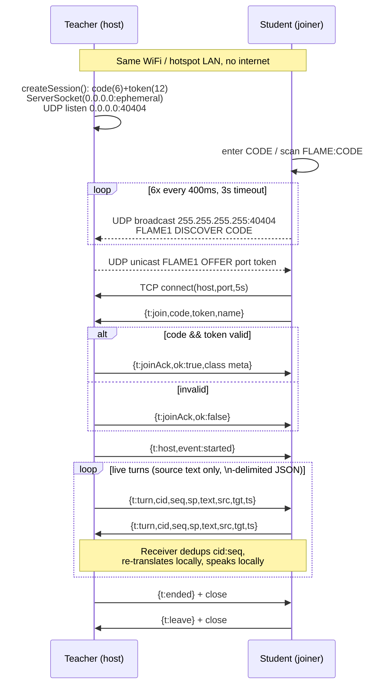

# FLAME Offline Classroom Connectivity

Two-device live classroom over local Wi-Fi / hotspot. No internet, no cloud, no external server.

> Implementation of record: `lib/services/classrooms/lan_classroom_sync.dart`
> Contract: `lib/services/classrooms/offline_classroom_sync.dart`
> Orchestration: `lib/services/classrooms/classroom_controller.dart`
> Wiring: `lib/app.dart` (`sync: LanClassroomSync()`)
> UI: `lib/screens/teacher_classroom_screen.dart`, `lib/screens/join_classroom_screen.dart`
> Permissions: `android/app/src/main/AndroidManifest.xml`

## 1. What is synced (and what is not)

* Synced: small text control messages — session metadata, join/leave, lifecycle events (`started` / `ended`), and classroom turns.
* A "turn" carries **source-language text only** (`text`, `src`, `tgt`, speaker, ids). Each device re-translates locally with its own `OfflineTranslationEngine` and re-speaks locally with its own TTS. Remote translated text is never trusted.
* Not streamed: audio, mic streams, images, files. ASR, NMT, and TTS all run on-device per phone.

Transport: plain TCP sockets + UDP broadcast discovery, newline-delimited JSON (`one object + \n per line`), UTF-8, `LineSplitter` framing.

## 2. Prerequisites

1. Both phones on the **same L2 network**: same Wi-Fi router, or one phone's hotspot joined by the other.
2. No login, no pairing, no internet. They just need mutually reachable private IPs (e.g. `192.168.x.x`) and broadcast capability.
3. Teacher creates the class first so a host exists to discover.

Android permissions used for this are only `INTERNET` + `ACCESS_NETWORK_STATE` (required for local sockets, not for internet access) plus `RECORD_AUDIO` for on-device ASR.

## 3. Teacher hosts a session

`LanClassroomSync.createSession()`:

1. Generates `code` (6 chars, alphabet `ABCDEFGHJKLMNPQRSTUVWXYZ23456789`) + `token` (12 chars = 2x6, `Random.secure()`).
2. Binds `ServerSocket` to `0.0.0.0:0` — OS picks an ephemeral TCP port.
3. Binds `RawDatagramSocket` to `0.0.0.0:40404` (`reuseAddress: true`) — discovery listener.
4. Stores `sessionInfo = {code, token, port, name, level, subject, teacher, lesson, topic}`, sets `status = hosting`.
5. `ClassroomController.teacherCreatesClass()` adopts the LAN-issued code so the on-screen code == network code, and displays it plus a `FLAME:<CODE>` QR (`qr_flutter`).

Teacher is now waiting. Discovery + TCP accept loops are live.

## 4. Student discovers the teacher (UDP broadcast)

`LanClassroomSync.joinSession(code)` -> `_udpDiscover(code)`:

1. Normalize: `code.trim().toUpperCase()`.
2. Bind an ephemeral UDP socket, `broadcastEnabled = true`.
3. Every `400 ms`, up to 6 times, send to `255.255.255.255:40404`:
   ```
   FLAME1 DISCOVER <CODE>
   ```
4. Teacher `_onDiscovery`: if `parts == [FLAME1, DISCOVER, <CODE>]` and `<CODE> == _code`, unicast back to the sender's IP/ephemeral port:
   ```
   FLAME1 OFFER <tcpPort> <token>
   ```
5. Student listens up to `3 s` for the first well-formed `OFFER` and builds `DiscoveredSession(host, port, token)` where `host` is the reply packet's source address. No reply -> `status = error` -> UI shows "couldn't find that class code".

Design notes:

* `code` is the search key (human-typable, shown on screen / QR). `token` is the secret (never displayed, only travels in `OFFER` + `JOIN`).
* No mDNS / NSD / Wi-Fi Direct group negotiation — just one custom broadcast string on fixed port `40404`.

## 5. Student joins (TCP + auth)

`_connect(found, code)` (student) + `_onClient(socket)` (teacher):

1. Student: `Socket.connect(host, port, timeout: 5 s)`.
2. Student attaches a **single** line-framed listener (`utf8.decoder + LineSplitter`) — joinAck and all later messages share it (a `Socket` supports one listener).
3. Student sends one line:
   ```json
   {"t":"join","code":"ABC123","token":"<12-char>","name":"StudentName"}
   ```
4. Teacher: the first message on a new socket **must** be `join` with `code == _code && token == _token`. If yes: add socket to `_clients`, reply:
   ```json
   {"t":"joinAck","ok":true,"code":"...","name":"...","level":"...","subject":"...","teacher":"...","lesson":"...","topic":"..."}
   ```
   If no: reply `{"t":"joinAck","ok":false}`, destroy socket.
5. Student awaits `joinAck` up to `5 s`. `ok == true` -> save `sessionInfo`, `status = joined`, `phase = waiting`, subscribe via `_listenToSync()`. Otherwise `status = error`.

`JoinClassroomScreen` tries the same-device demo broker first (`studentJoins`), then falls back to `studentJoinsRemote` (real LAN).

## 6. Live data streaming

### 6.1 Wire format

One JSON object per line, `\n` terminated. Message types:

| `t` | Direction | Payload | Meaning |
|---|---|---|---|
| `join` | S -> T | `code, token, name` | auth request |
| `joinAck` | T -> S | `ok, + class metadata` | accept / reject |
| `turn` | both | `cid, seq, sp, text, src, tgt, ts` | one classroom utterance (source text) |
| `host` | T -> S | `event: started` | teacher started class |
| `ended` | T -> S | — | teacher ended / closed |
| `leave` | S -> T | — | student left |

`turn` example:
```json
{"t":"turn","cid":"teacher","seq":7,"sp":"teacher","text":"पौधे क्या हैं?","src":"hindi","tgt":"santhali","ts":1727000000000}
```

`cid` = `teacher` on host, `student-<random31>` per student. `seq` = per-sender monotonic counter (`++_seq`).

### 6.2 Send paths

* Teacher: `sendTeacherTurn()` fans out `writeln()` to a snapshot of all `_clients`.
* Student: `sendStudentTurn()` writes to its single `_socket`.
* Teacher receiving a student `turn` (`_handleStudentMessage`): dedup, emit on `_turns` broadcast stream, **relay unchanged** (same `cid`+`seq`) to all *other* students.
* Student receiving a teacher `turn` (`_handleTeacherMessage`): dedup, emit on `_turns`.

Writes are best-effort (`try write`); cleanup happens via `onDone` / `onError`.

### 6.3 Ordering / dedup

`_parseTurn()`:

* Key `cid:seq`. Drop if key in `_seen` or `seq <= _lastSeq[cid]` (duplicate / out-of-order).
* Otherwise record and emit `ClassroomSyncTurn(speaker, text, sourceLanguage, targetLanguage, timestamp)`.
* Ordering is per-sender only. There is no global clock sync or retransmission — small, ordered-per-connection TCP is enough for classroom text.

### 6.4 Controller integration (no echo loops)

`ClassroomController._listenToSync()` subscribes to `receiveTurn()` + `hostEvents()`:

* Remote turn -> `_onRemoteTurn()` -> `processTurn(..., fromRemote: true)` — translates locally, appends `Utterance` to transcript, enqueues TTS. **Never re-sent.**
* Local turn -> `processTurn(..., fromRemote: false)` — same local pipeline **plus** forward once via `sendTeacherTurn` / `sendStudentTurn`.
* `startClass()` broadcasts `sendHostEvent('started')` -> students `waiting -> live`.
* `endClass()` / `leaveSession()` tears down sockets (see below); remote `ended` -> `_onSyncClosed()` -> `phase = ended`.

## 7. Leave, end, and reconnect

Teacher `leaveSession()` (hosting): send `{"t":"ended"}` to all clients, destroy them, `close()` server + UDP socket, reset to `idle`.

Student `leaveSession()` (joined): send `{"t":"leave"}`, destroy socket, reset to `idle`.

Drop handling (`_onTeacherGone`, student side): if still `joined` and not explicitly leaving, try up to `3` times (1 s apart) to re-`discover(code)` + `_connect()`. If all fail, set `idle` and emit `hostEvents('ended')` so the UI surfaces "class ended". Streams stay open for reuse; `dispose()` closes them only in tests/teardown.

## 8. Failure modes

* Wrong network / different hotspot: no `OFFER` within 3 s -> `error`, "check with your teacher".
* Wrong code: teacher ignores `DISCOVER` (code mismatch) -> same as above.
* Wrong / missing token: `joinAck ok:false` -> `error`.
* Teacher closes app / hotspot off: TCP `onDone`, student reconnect x3, then `ended`.
* Two teachers with same code on one LAN: student takes the first `OFFER` (6-char code collision is possible but unlikely; token prevents hijack after discovery).

## 9. Flow chart



Flowchart boxes (for draw.io / Lucidchart):

1. Start: both devices join same Wi-Fi / hotspot.
2. Teacher: Create class -> host TCP + UDP:40404 -> show CODE + QR (waiting).
3. Student: type CODE / scan QR.
4. Student: UDP broadcast `DISCOVER CODE` -> wait `OFFER port token` (3 s).
5. Found? No -> error. Yes -> TCP connect (5 s).
6. Send `JOIN code+token` -> wait `JOINACK` (5 s).
7. Accepted? No -> error. Yes -> waiting room.
8. Teacher taps Start -> `HOST started` -> both live.
9. Loop: speak -> local ASR/NMT/TTS -> send `TURN source-text` -> peer dedups -> local NMT/TTS.
10. End: teacher `ENDED` closes server; student `LEAVE` closes socket; drop -> 3x rejoin else ended.

## 10. Security / scope limits

* Security is a random code + token checked on join. No encryption, no identity beyond self-reported `name`. Anyone on the same LAN who guesses/sniffs the 6-char code still needs the 12-char token from the `OFFER`.
* Messages never leave the LAN sockets. No cloud copy.
* Known limits: plain-text LAN traffic, first-`OFFER`-wins on code collision, no retransmission above TCP, per-sender (not global) ordering, text turns only.
